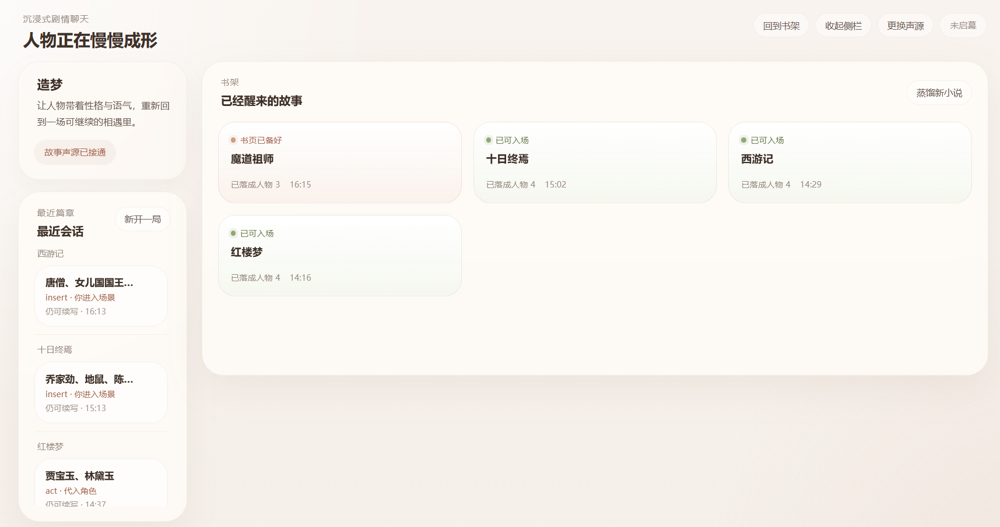
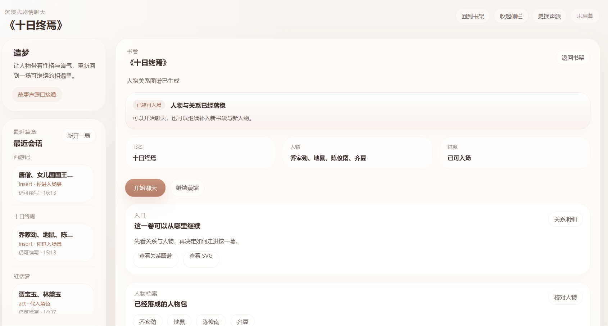
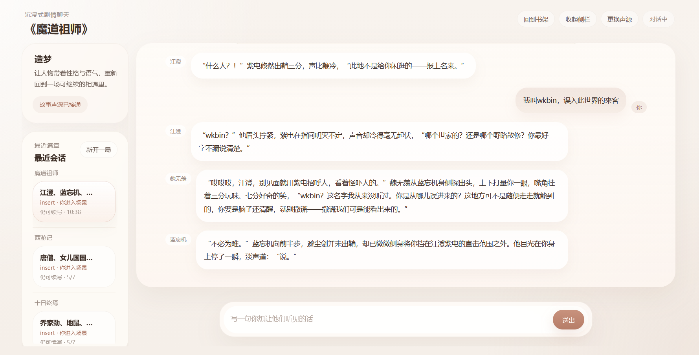

# 造梦.skill

[中文](README.md) | [English](README.en.md)

> *“有些角色不是被写完了，只是还没被真正叫醒。”*

**让角色走出纸面，拥有第二次呼吸。**

[](LICENSE)
[](https://python.org)
[](https://github.com/wkbin/zaomeng)
[](https://github.com/wkbin/zaomeng)

&nbsp;

[安装](#安装) · [使用方式](#使用方式) · [增量蒸馏](#增量蒸馏) · [Web-UI](#Web-UI)

把中文小说人物蒸馏成可复用的人物包，生成关系图谱，再让他们按自己的性格、立场、关系和记忆重新开口说话。

`zaomeng` 不是一个泛用聊天项目。  
它更像一套专门面向小说人物蒸馏、关系抽取、图谱导出和角色互动演绎的工作流。

- 从小说里蒸馏人物档案
- 抽取人物关系并导出图谱
- 让角色按人设进入 `act` / `insert` / `observe`

如果你想要的不是“AI 在陪聊”，而是“林黛玉像林黛玉，齐夏像齐夏，一群角色放进同一个场景里还能各说各话”，这个项目就是为这件事做的。

它想做的也不是“让角色套一层聊天皮”。  
它想做的是另一件更难、也更有意思的事：

- 让人物不是只有设定，而是有可持续复用的人设骨架
- 让关系不是一句描述，而是能被看见、被引用、被继续演化
- 让对话不是统一腔调，而是真的像“这个人会说出来的话”

## 安装 🚀

### 安装 skill

`zaomeng` 的主要对外形态是 skill 包：`zaomeng-skill/`

```bash
# 安装到 OpenClaw
openclaw skills install wkbin/zaomeng-skill

# 安装到 ClawHub
npx clawhub@latest install zaomeng-skill
pnpm dlx clawhub@latest install zaomeng-skill
bunx clawhub@latest install zaomeng-skill

# 安装到本地 skills 目录
python scripts/install_skill.py --skills-dir <your-skills-root>
```

### 依赖 🧩

```bash
pip install -r requirements.txt
```

如果你只是想运行 Web UI 或使用一键安装脚本，通常只需要：

```bash
pip install -r requirements.runtime.txt
```

### Web UI 🖥️

如果你不想从 skill 或 CLI 入口开始，现在也可以直接启动 Web UI。

#### 一键安装（Linux / macOS / WSL2 / Termux）

```bash
curl -fsSL https://raw.githubusercontent.com/wkbin/zaomeng/main/scripts/install.sh | bash
source ~/.bashrc
zaomeng
```

如果你用的是 `zsh`，把第二行改成：

```bash
source ~/.zshrc
```

安装脚本会：

- 下载当前仓库到 `~/.local/share/zaomeng`
- 创建独立虚拟环境
- 默认安装更轻的 `requirements.runtime.txt`
- 写入 `~/.local/bin/zaomeng` 启动命令
- 自动把 `~/.local/bin` 加入 shell 的 `PATH`

安装完成后，`zaomeng` 默认直接启动 Web UI。你也可以使用：

```bash
zaomeng uninstall
zaomeng update
zaomeng web --reload
zaomeng bump-web-assets
zaomeng install-skill --skills-dir <your-skills-root>
```

#### 手动启动

如果你希望手动拉仓库并本地启动，可以按下面来：

```bash
git clone https://github.com/wkbin/zaomeng.git
cd zaomeng
pip install -r requirements.txt
python scripts/run_webui.py --reload
```

启动后打开浏览器访问 `http://127.0.0.1:8000`，就可以直接走这条完整工作流：

1. 先配置模型
2. 上传小说并锁定角色
3. 自动蒸馏人物并生成关系图谱
4. 进入 `act` / `insert` / `observe`

当前 Web UI 已经支持：

- 线性引导式工作流，不需要先理解 skill 生态
- 保存模型配置后直接开始蒸馏
- 接通模型后直接试玩 `builtin_novels/` 里的内置小说，不必先手动蒸馏
- 导入 / 导出统一的“小说包”，把一整卷可试玩资产带走或带回
- 一键把当前书卷发布进 `builtin_novels/`，方便沉淀成内置试玩样本
- 根据正文体量自动建议取样范围，并显示预计分批轮次、模型调用次数、粗估 token 与耗时区间
- 自动显示人物蒸馏进度与关系图谱产物
- 长篇正文自动分批蒸馏 / 分批关系抽取，再汇总成最终人物包与关系图谱
- 书架式工作台，可直接回到某一卷继续蒸馏、校对、看关系或开聊
- 人物校对页，支持关键字段补全、证据不足检查与二级字段微调
- 场景卡、角色卡、开局模板的创建、编辑、选择与复用
- 聊天过程中自动推荐下一幕场景卡，并支持会话内切换场景
- 会话恢复、最近会话续聊、群聊继续与工作台直接入场
- 对话上下文自动压缩，按活跃角色裁剪人物/关系上下文，并注入会话记忆摘要
- 在同一页面查看 transcript、继续群聊、删除历史会话
- 支持增量蒸馏与再次蒸馏入口

如果你想把 `zaomeng` 当成一个真正可以直接使用的产品入口，而不是只当作 skill 附件，Web UI 就是现在最完整的主入口。

现在这条链路也已经开始具备“素材流转”能力：

- 你可以先在本地完整蒸馏一本小说
- 再从书卷详情导出成一个小说包
- 也可以直接一键放进仓库根目录的 `builtin_novels/`
- 其他人拉下项目、配置好模型后，就能直接在“试玩内置小说”里体验

这套包格式的目标，是统一内置试玩、导入导出和本地素材复用，而不用再为 Web UI、内置资源和可移植文件各维护一套格式。

对于长篇或高体量正文，Web UI 不再要求你自己猜“多少句 / 多少字才够”。  
它会先按正文体量给出建议，再在体量过大时自动切成多块，分批蒸馏人物、分批抽取关系，最后再做一次汇总。

### Web-UI 预览





## 你可以拿它做什么 ✨

### 1. 蒸馏人物 🎭

给它一部小说，它会尽量从正文里整理出可复用的人物包，例如：

- 核心身份
- 核心动机
- 性格底色
- 说话风格
- 决策逻辑
- 情绪触发点
- 关键羁绊
- 人物弧光

它不是只做一页“人物简介”，而是尽量产出后续还能继续用于聊天、演绎、纠错和增量更新的人设底稿。

### 2. 生成人物关系图谱 🕸️

除了结构化关系字段，它还会输出可视化图谱，让你直观看到：

- 谁信任谁
- 谁依赖谁
- 谁和谁在拉扯、竞争、对立

当前常见产物包括：

- 关系结果 Markdown
- Mermaid 源码
- HTML 图谱
- SVG 图谱

### 3. 进入角色互动 💬

蒸馏完成后，现在是 **3 种玩法**：

- `act`：你代入某个角色发言，可以单聊，也可以直接加入多人群聊
- `insert`：你不扮演书中角色，而是以“你自己”的身份进入小说场景，直接和角色互动
- `observe`：你不下场，只观察多个角色围绕一个场景自然展开

最直观的理解方式是：

- 想说“我来当宝玉，你们继续接”，用 `act`
- 想说“我本人走进大观园，和他们直接说话”，用 `insert`
- 想说“我先不说话，看看他们自己怎么聊”，用 `observe`

其中 `insert` 会在首次进入时建立一张很轻的场景身份卡，通常包括：

- 角色们如何称呼你
- 你在场景中的身份
- 你偏自然闲聊、沉浸互动，还是试探型互动
- 你对剧情的影响范围

现在聊天入口也不再只是“选几个人直接开口”。  
你可以在进入前或对话中逐步叠加这些辅助层：

- 场景卡：定义地点、气氛、推进方向与这一幕的开场状态
- 角色卡：为 `insert` 模式准备你的身份、语气、动机与在场定位
- 开局模板：把入场方式、参与角色、场景卡、角色卡打包成一套可复用开局
- 自动场景推荐：会话进行中，系统会结合当前局势推荐更适合的下一幕

## 使用方式 🛠️

推荐顺序很简单：

1. 提供小说文本或文件
2. 指定要蒸馏的角色
3. 等人物档案和关系图谱生成完成
4. 再进入 `act`、`insert` 或 `observe`

### 你可以直接这样说

```text
帮我从这本小说里蒸馏林黛玉、贾宝玉、薛宝钗
```

```text
蒸馏完成后，让林黛玉、贾宝玉、薛宝钗进入群聊模式
```

```text
让我扮演贾宝玉，林黛玉来回我
```

```text
让我以我自己进入红楼梦，和林黛玉、贾宝玉聊天
```

```text
生成关系图谱，我要看 HTML 和 SVG
```

## 它现在怎么工作 🧠

当前版本是 **LLM-first**：

- 宿主或运行环境中的 LLM 负责真正的语言生成
- `zaomeng` 负责准备 prompt、人物包、关系信息和辅助产物
- `zaomeng-skill` 优先复用宿主已经提供的模型能力

重点已经不是“硬编码一堆规则把句子拼起来”，而是给模型更清楚的人设、关系和场景约束，让输出更像角色本人。

与此同时，Web UI 里的对话链路也开始更重视“长聊能不能撑住”：

- 会话会自动维护摘要化记忆，而不是无上限把所有历史生硬塞进上下文
- 人物上下文会优先保留当前活跃角色，而不是每轮都把所有人完整展开
- 关系摘录会按当前参与者和场景需要裁剪，减少 token 浪费
- 自动回复建议、旁观模式推动语、场景切换提示都会复用这些压缩后的上下文

## 增量蒸馏 ♻️

项目支持增量蒸馏。

如果同一本小说下某个角色已经蒸馏过，下一次不会粗暴重来，而是尽量复用已有：

- `PROFILE`
- 拆分人格文件
- `MEMORY`
- 用户纠错

这很适合：

- 连载小说补新章节
- 长篇分批蒸馏
- 多轮修正后持续提升人物质量

## 长篇自动分批 📚

当正文体量较大，或者单次请求因为网关 / 连接问题不稳定时，`zaomeng` 会自动退回到分批模式：

- 人物蒸馏：先把证据切成多块，分别生成局部 `PROFILE` 草稿，再汇总成最终人物档案
- 关系抽取：先对多个证据块分别生成局部关系图，再汇总成最终 `RELATION_GRAPH`

这意味着你不需要自己手动把小说拆成很多小段去试。  
Web UI 会直接告诉你：

- 当前建议取样范围
- 预计会分成几轮
- 预计大概会发起几次模型调用
- 粗估 token 消耗
- 粗估人物蒸馏耗时、关系抽取耗时与整体耗时区间
- 实际这次用了几块蒸馏 / 几块关系抽取

## 项目结构 📦

仓库目前主要分成三层：

- `src/`：核心源码
- `zaomeng-skill/`：可发布的 skill 包
- `tests/`：回归测试

其中 skill 包里最重要的资产通常是：

- `prompts/`
- `references/`
- `tools/prepare_novel_excerpt.py`
- `tools/build_prompt_payload.py`
- `tools/export_relation_graph.py`

## 一句话总结 ✨

`zaomeng` 想做的，不是“会说话的 AI”。  
而是让小说里的人，带着自己的性格、关系、语气和记忆，重新开口。

## License

主项目：`AGPL-3.0-only`  
`zaomeng-skill`：`MIT-0`
